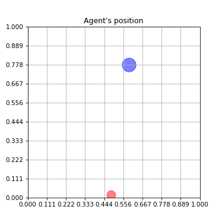

# Continuous value iteration (CVI) with Imaginary Experience Replay (IER)

This package is a minimal implementation of Continuous Value Iteration and Imaginary Experience Replay for a simple continuous state and action grid-world. 

To run it for multiple seeds and configurations:

```python
python train.py\
    train_cycles=100\
    seed=0,1,2\
    augment.HER=false,true\
    augment.IER=false,true\
    --multirun
```



## What's next?

I am interested in investigating the role of experience expansion using 
model-based RL. Can we learn a transition model to generate rollouts and 
then apply imaginary/hindsight experience replay? Just like hindsight helps
to generalize accross goals, imagination rollouts helps to visit states where
no experience has gone before. As more real-experience is gathered, the quality of the transition model improves.

To-do list:

* [x] Include a module for rollouts with a learned transition model (with a neural network)
* [ ] Compare with SAC
* [ ] Learn the value function with a neural network. Then use the learned differentiable value function to learn an explicit policy from gradients. This should be helpful when learning from high-dimensional input spaces.
* [ ] Learn the transition model using the Value Equivalence principle.
* [ ] Use experience replay with reward shaping.


## Reference

[Gerken, A. and Spranger, M., 2019, May. Continuous Value Iteration (CVI) Reinforcement Learning and Imaginary Experience Replay (IER) for learning multi-goal, continuous action and state space controllers. In 2019 International Conference on Robotics and Automation (ICRA) (pp. 7173-7179). IEEE.](https://arxiv.org/pdf/1908.10255.pdf)
